# ONES Project 多语言多环境配置独立开发

# 背景

当前开发 Project 不同环境是通过 ONES Helper 进行参数配置，比如 私有部署 或者 国内海外
如果某个迭代涉及到多个环境，那么我们就需要频繁修改参数，不停刷新

1. 国内 Sass
2. 国外 Sass
3. 国内私有
4. 国外私有

组合配置就有 4 种，如果加上多语言（当前只有 3 种语言，后续增加更多），就有 12 种配置
12 种配置的切换，就会导致我们开发效率低下，增加开发成本，消耗开发精力，降低环境校验成本，就能降低 bug 率

为了解决这个问题，基于 whistle 开发了这个 环境代理插件

## 安装

```sh
# 需要安装 whistle
npm i whistle -g

# 安装 whistle 插件
w2 install whistle.wisdom-dev --registry=https://npm2.myones.net/
```

如果你还没有用过 whistle，可以参考下 这个文档 进行安装 https://our.ones.pro/wiki/?from_wecom=1#/team/RDjYMhKq/space/BzU9noyk/page/AfWetxfJ

## 使用

### 1、启动 whistle

```sh
w2 start
```

打开 whistle 页面 ，一般是 http://localhost:8899

### 2、开启插件

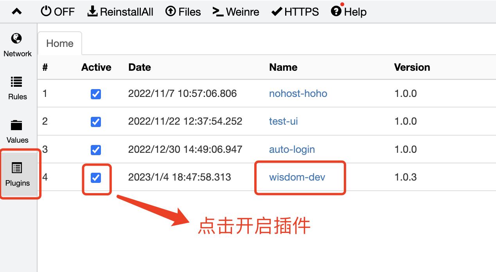

### 3、注入插件

开启之后，新建 whistle 规则，比如叫做 plugins

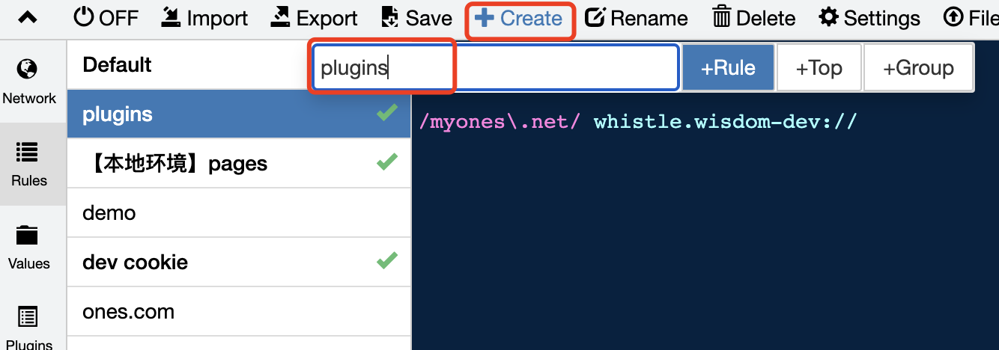

填入以下内容，表示在匹配了 myones.net 这个域名的页面都会注入这个插件

比如 dev.myones.net，或者 previewglobal.myones.net 都可以匹配成功

```sh
/myones\.net/ whistle.wisdom-dev://
```

如果只想匹配更加具体，不使用正则，直接写死域名即可

```sh
dev.myones.net whistle.wisdom-dev://
```

最后就像这样

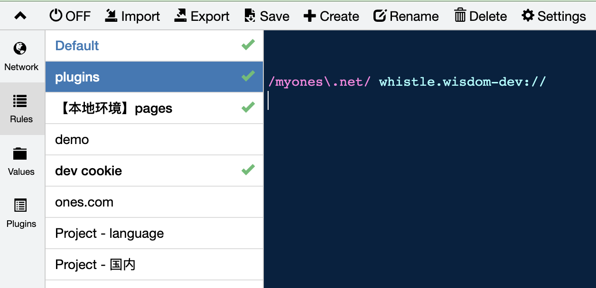

### 使用插件

进入页面，比如 https://dev.myones.net/project/U0054 ， 可以看到右下角会注入一个面板，会显示当前开发环境信息

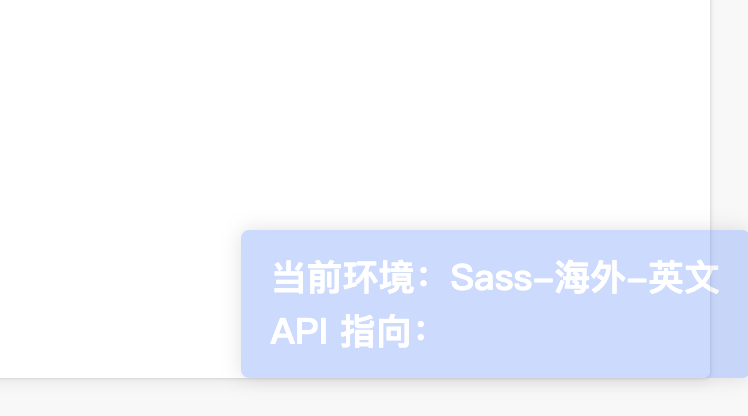

点击面板，会出现一个弹窗

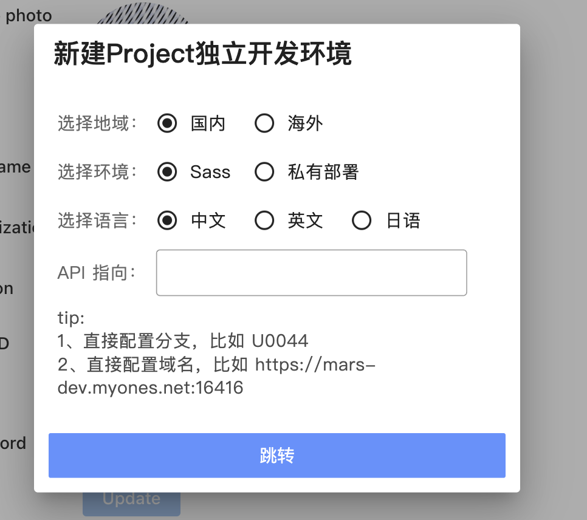

你现在可以根据面板选择相应的环境

比如你现在想开发 **国内的 sass 下的中文语言**，选择对应的环境后，然后点击**跳转按钮**

就会新开一个浏览器 tab，链接是 https://zh.cn.dev.myones.net/project/U0054

其中 zh 表示中文，cn 表示国内 Sass

对应的

语言方面：en 表示英文，ja 表示日文

环境方面：com 表示海外 Sass，comp 表示海外私有部署，cnp 表示国内私有部署

根据你选择的环境，会进行组合

https://en.cnp.dev.myones.net/project/U0054

https://ja.cnp.dev.myones.net/project/U0054

https://zh.com.dev.myones.net/project/U0054

等等

#### 开发优势

你可以一次性开多个环境，他们是独立的，不会相互影响

同时，你可以在配置环境的同时指定接口指向，同样的，每个 tab 的接口指向都是独立的，不会相互影响

当你的需求需要同时涉及多个环境的时候，你再也不需要频繁切换配置，消耗我们的开发精力

## 原理

### 1. 语言独立的处理

当前 project 前端取语言标识的处理是
1、优先取 cookie 中 language 字段
2、其次取 navagator.language

所以这里的处理是

**1、在页面中注入一段脚本设置 cookie**

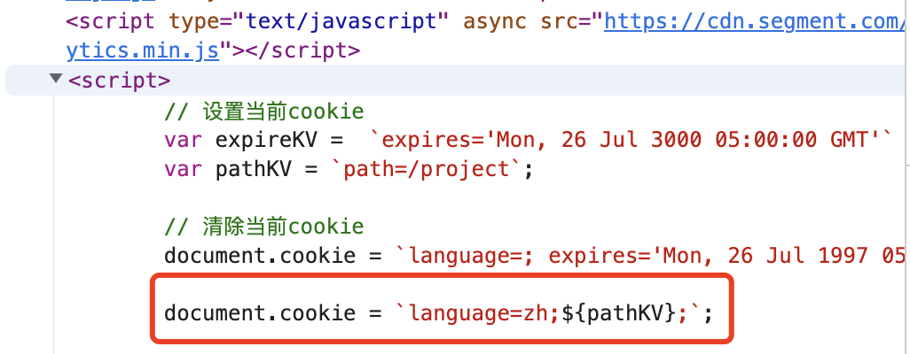

**2、在所有接口的响应头添加 set-cookie**

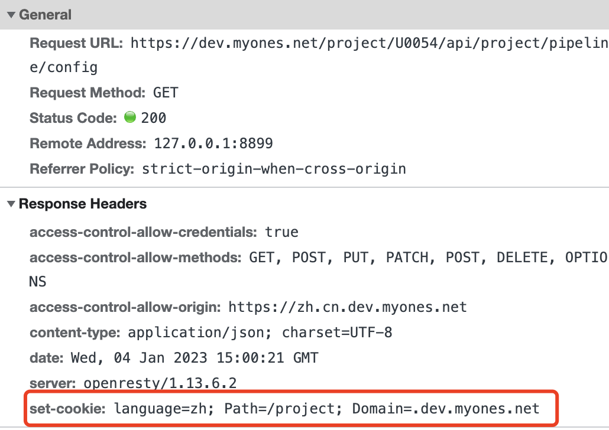

**3、在所有接口的请求头添加 cookie-language**

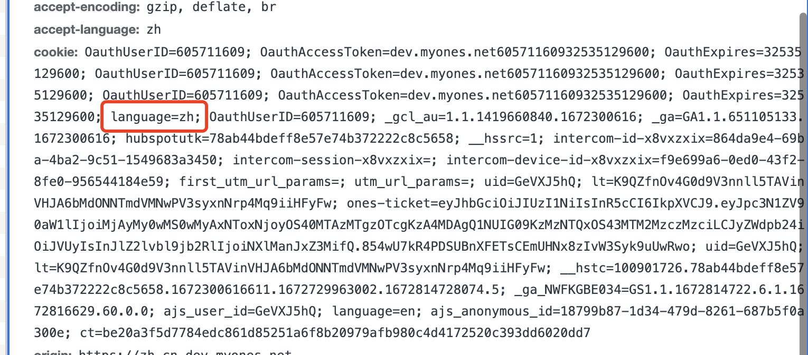

因为 project 显示的语言一部分是前端词条，一部分是后端返回，所以请求头和响应头都需要拦截修改

这样来保证语言的稳定性一致性，不会错乱

并且不会影响原来功能的 language cookie，因为他们不是同一个 domain

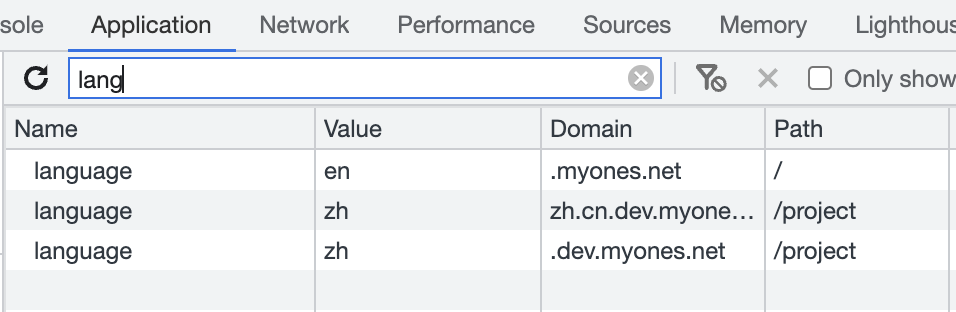

第一个 language 是原来 project 设置语言的 cookie

后两个 language 是插件新增的 cookie

当你把 多环境开发的 tab 关闭的时候，会自动把新增的后两个 cookie 清除掉

### 2. 环境的处理

当前 project 主要的两个环境标识 是从 window.onesConfig 获取的

operatingRegion 表示 海外、国内
cloudType 表示 Sass 、私有部署

所以这里的处理是通过判断 链接上的域名，来动态注入对应的 onesConfig 标识

比如 cnp.dev.myones.net 就会注入

```js
window.onesConfig = {
  operatingRegion: "cn",
  cloudType: "private",
};
```

com.dev.myones.net 就会注入

```js
window.onesConfig = {
  operatingRegion: "com",
  cloudType: "sass",
};
```

另外 token_info 接口也会有相应的语言标识，所以这里通过会拦截 token_info 的接口，修改响应的数据

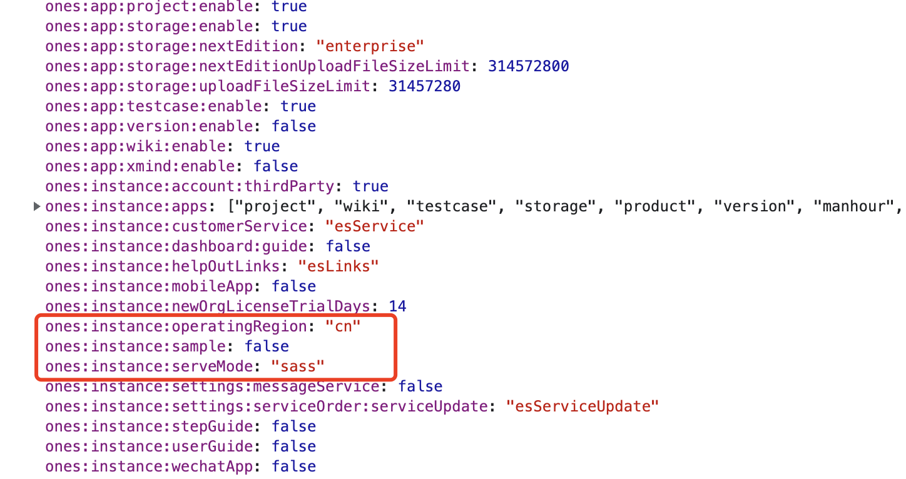

### 3. 接口指向独立的处理

你设置了接口指向之后，会在对应的接口配置信息 存放在 window.name 中

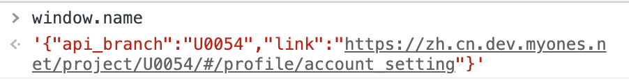

之后就和原来 ones-helper 的处理是一样的

配置了分支，就会在 Header 中加入

```
x-ones-api-branch-project: /project/${apiBranch}/
x-ones-api-branch-wiki:	/project/${apiBranch}/
x-ones-api-branch-stripe: /project/${apiBranch}/
```

配置了 host，则是

```
x-ones-api-host: ${apiBranch}/project/api/project/
```

## 影响范围

只有在多环境开发下才会涉及以下修改

比如 ja.comp.dev.myones.net 下

在没有任何标识的域名下不会进行任何修改，比如 dev.myones.net

1.页面注入脚本，注入 onesConfig ，修改其中 operatingRegion 和 cloudType 字段

2.页面注入脚本，修改 cookie.language

3.页面注入脚本，解析 window.name 获取 api 指向，设置 cookie.api_branch

4.修改所有接口 Reqsponse Header，加入 set-cookie ：language

5.修改所有接口 Request Header，设置 cookie ：language

6.修改 token_info 接口 响应数据，设置 user.language 字段

7.修改 token_info 接口 响应数据，设置 constraints.ones:instance:operatingRegion 和 constraints.ones:instance:serveMode

8.修改所有接口 Reqsponse Header，设置跨域头为 ja.com.dev.myones.com(举例)（因为接口域名和 页面域名不一致）

9.修改所有接口 Request Header，设置 origin 和 refer 为当前域名

10.修改所有接口 Request Header，设置 接口指向相关 header，比如 x-ones-api-branch-project
